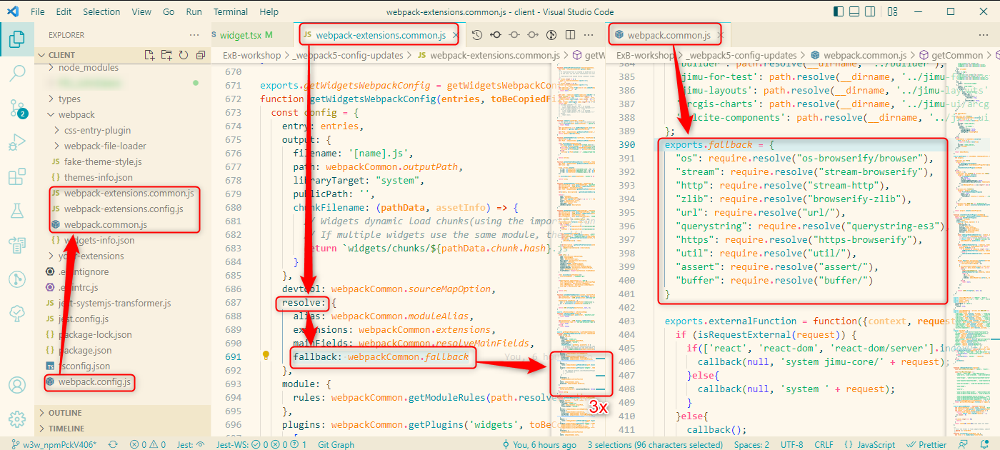

### Experience Builder Extensions Repo
# what3words Widget
### by [Niklas Köhn](https://github.com/esride-nik/), Esri Deutschland

---

## How to use this widget
Clone the sample repo into your Experience Builder Client root folder and restart your watcher.

## About
This is a widget developed for demonstration purposes at Esri Deutschland, using the what3words REST API 

## Having issues?

## TS compiler cannot resolve import from '@what3words/api'
Try adding the path to the package explicitely to the typeRoots in tsconfig.json:
```
    "typeRoots": [
      "w3w-arcgis-exb-widget/node_modules/@what3words\\api/dist/lib/client"
    ],
```

## Ideas for further development
* search by text input, i.e. the geocoding of a three-word address (maybe use the w3w Locator Services instead of the REST API + JSAPI Search widget to take advantage of the built-in suggest functionality)
* convert selected vertices or point features to three-word addresses
* check which features are in the clicked 3x3 meter square
* connect with Directions Widget
* add switch in backend to show language dropdown on widget frontend
* parse url parameters to directly zoom to a w3w address
* implement widget output data source: https://developers.arcgis.com/experience-builder/guide/core-concepts/data-source/#widget-output-data-source 

## Participation
If you want to participate, please create a fork and send a pull request after developing a new feature. Feel free to open an issue to start a discussion or contact us directly! We are looking forward to your ideas and maybe even productive uses of the widget!  

## Polyfills for Node APIs in Experience Builder >= 1.8

Webpack 5 no longer includes polyfills for node core modules. This manifests in the error message ``BREAKING CHANGE: webpack < 5 used to include polyfills for node.js core modules by default``, meaning: Packages that use node.js core modules no longer work natively with webpack 5.

For more information on this topic, here is a good explanation: "[Webpack 4 automatically polyfilled many node APIs in the browser. This was not a great system, because it could lead to surprisingly giant libraries getting pulled into your app by accident, and it gave you no control over the exact versions of the polyfills you were using. So Webpack 5 removed this functionality.](https://gist.github.com/ef4/d2cf5672a93cf241fd47c020b9b3066a)"

There are many descriptions for the workaround, directly in the error messages in the console and also under the above mentioned source: The required sources have to be entered in ``webpack.config`` under ``resolve.fallback`` and installed via ``npm i``.

So far so good. Except that this configuration has been chopped up in ArcGIS Experience Builder and spread over several files:



### From left to right:
* ``webpack.config.js`` in the ``client`` root folder referencing ``webpack-extensions.config.js`` in the ``webpack`` subfolder.
* ``webpack-extensions.config.js`` builds the config from references to ``webpack-extensions.common.js``
* ``webpack-extensions.common.js`` references the actual polyfills in ``webpack.common.js``.

### Steps to do:
* In ``webpack-extensions.common.js``, add a ``fallback`` property to the ``resolve`` object in 3 places: ``getTemplatesWebpackConfig()``, ``getWidgetsWebpackConfig()`` and ``getThemesWebpackConfig()``:
    ```
    resolve: {
        alias: webpackCommon.moduleAlias,
        extensions: webpackCommon.extensions,
        mainFields: webpackCommon.resolveMainFields,
        fallback: webpackCommon.fallback
    },
    ```
* In ``webpack.common.js``, add the references to the polyfilled packages under ``exports.fallback``, e.g.:
    ```
    exports.fallback = {
        "os": require.resolve("os-browserify/browser"),
        "util": require.resolve("util/"),
        "http": require.resolve("stream-http"),
        "url": require.resolve("url/"),
        "stream": require.resolve("stream-browserify"),
        "https": require.resolve("https-browserify"),
        "zlib": require.resolve("browserify-zlib"),
        "assert": require.resolve("assert/"),
        "buffer": require.resolve("buffer/"),
    }
    ```
* ToDo: Install all referenced NPM packages on ``client`` level, e.g.:
    ```
    npm i os-browserify
    npm i util
    npm i stream-http
    npm i stream-browserify
    npm i https-browserify
    npm i browserify-zlib
    npm i buffer
    npm i assert
    npm i url
    ```

That works.

The trouble is, that the webpack files on root level of the "client" folder are not part of the "exb-web-extension-repo", but are delivered with ExB. Now if you use NPM packages in your custom widgets that require polyfills, you have to update the webpack configs on Node JS root level. Please refer to the ``_webpack5-config-updates`` subfolder in this repository for sample files.

[Originally published in the ArcGIS community.](https://community.esri.com/t5/arcgis-experience-builder-questions/npm-packages-in-experience-builder-1-8/m-p/1181885#M4574)